# HealthNet Frontend

A React single-page application providing role-based healthcare management portals for patients, doctors, staff, and administrators.

<div align="center">

### 🌐 [**Live Demo → zero-70.github.io/Healthnet-frontend**](https://zero-70.github.io/Healthnet-frontend/)

</div>

---

## 🚀 Live Deployment

| | |
|---|---|
| **This app** | [zero-70.github.io/Healthnet-frontend](https://zero-70.github.io/Healthnet-frontend/) |
| **Backend API** | [healthnet-zair-7aa588192c75.herokuapp.com](https://healthnet-zair-7aa588192c75.herokuapp.com) |
| **Backend source** | [github.com/ZERO-70/HealthNet-backend](https://github.com/ZERO-70/HealthNet-backend) |
| **Full project overview** | [github.com/ZERO-70/HealthNet-FullStack](https://github.com/ZERO-70/HealthNet-FullStack) |

### Demo Accounts

| Role | Username | Password |
|---|---|---|
| Admin | `admin` | `admin123` |
| Doctor | `doctor1` | `doctor123` |
| Staff | `numan` | `numan123` |
| Patient | `patient1` | `patient123` |

---

## 📸 Screenshots

<div align="center">


</div>

<details open>
<summary><b>🔐 Landing, login and registration</b></summary>
<br>

| Login | Registration |
|:--:|:--:|
| 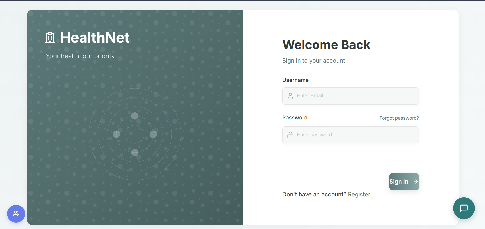 | 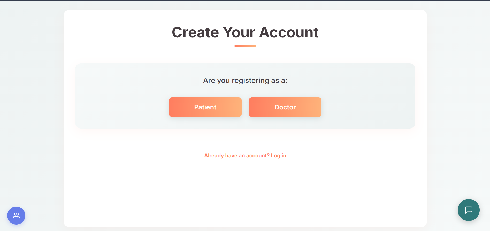 |

</details>

<details>
<summary><b>🏥 Staff Portal</b></summary>
<br>

| Staff dashboard | Departments overview |
|:--:|:--:|
|  | 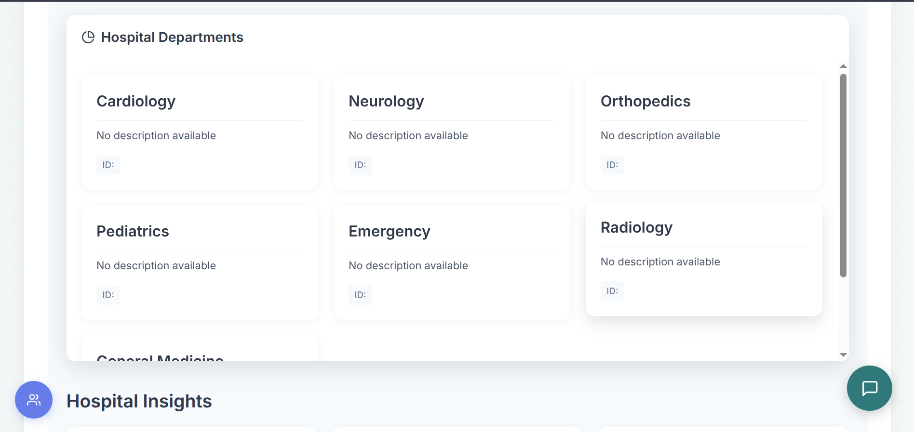 |

| Staff profile | Inventory management |
|:--:|:--:|
| 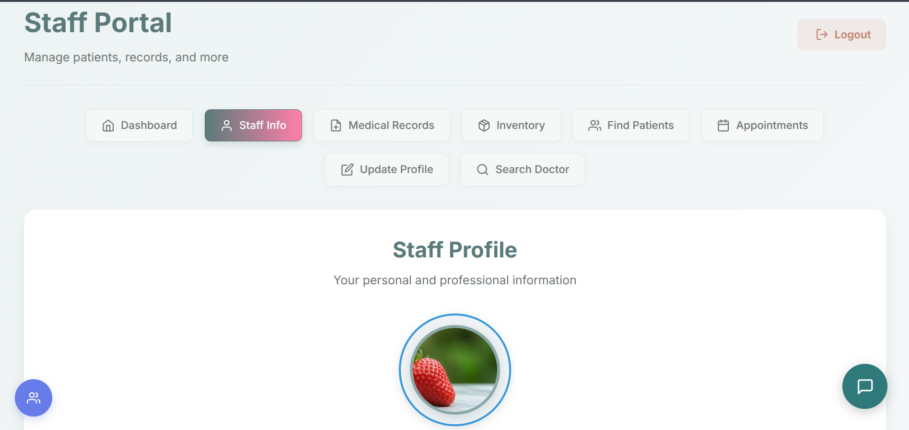 | 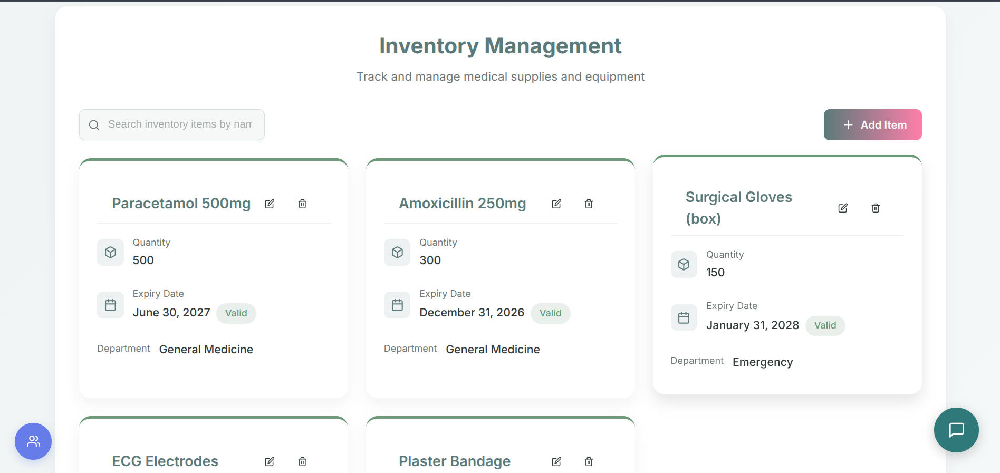 |

| Find patients | Search doctors |
|:--:|:--:|
| 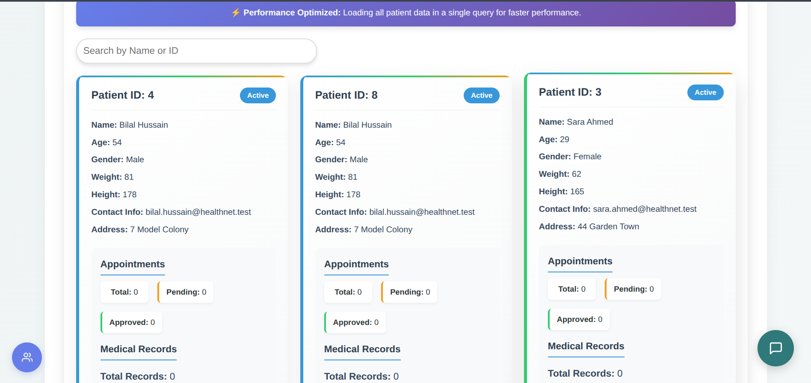 | 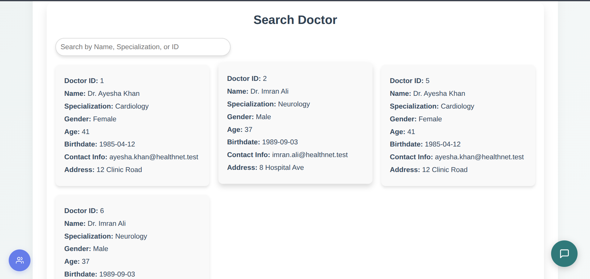 |

</details>

<details>
<summary><b>🛡️ Admin Portal</b></summary>
<br>

| Admin overview | Manage staff |
|:--:|:--:|
| 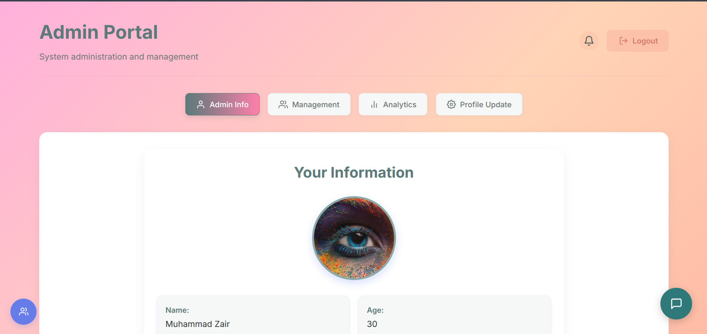 | 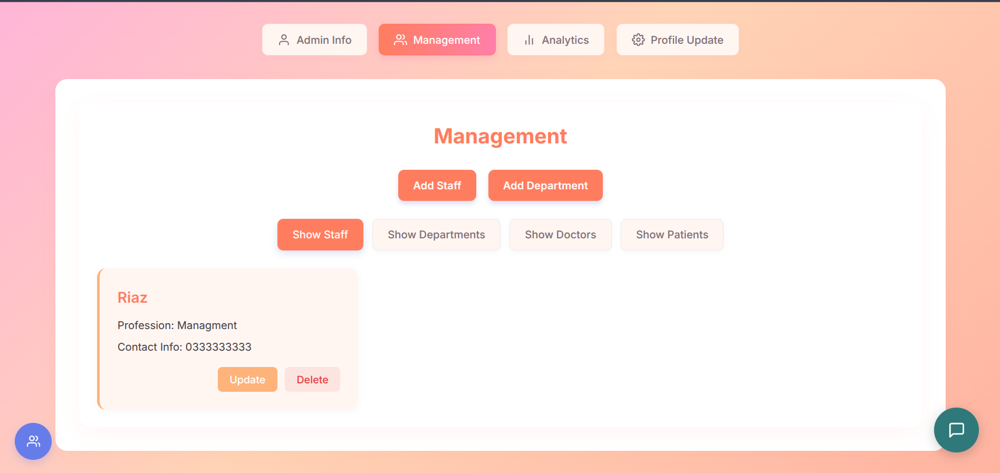 |

| Manage doctors | Manage patients |
|:--:|:--:|
| 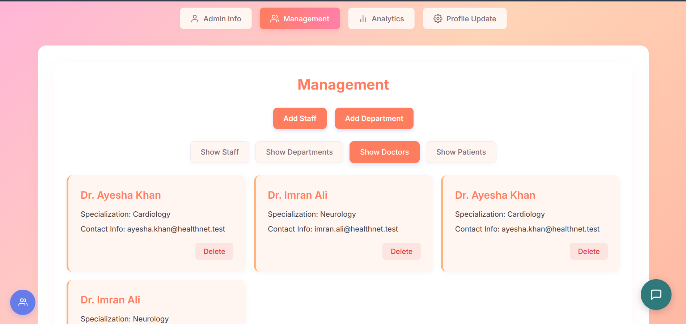 | 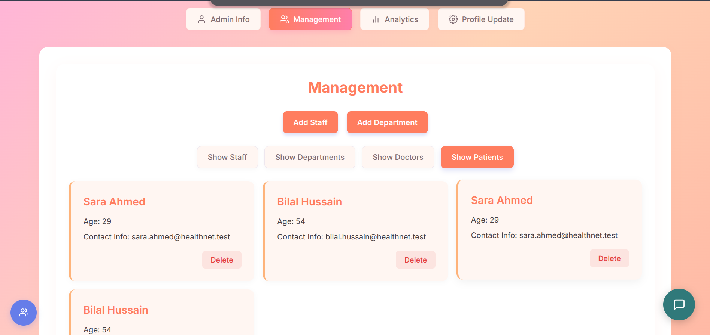 |

</details>

---

## Features

- **Role-Based Portals:** Dedicated dashboards and interfaces for Patients, Doctors, Staff, and Admins
- **Appointment Management:** Booking, tracking, and cancellation UI for patients and doctors
- **Medical Records Management:** Access to medical records, attachments, and lab results, including an audit trail
- **Department & Staff Management:** UI for administrators and staff to manage departments, staff roles, and subscriptions
- **Multi-Tab Session Management:** Session control keeping data consistent when multiple tabs are open
- **Subscriptions:** Dedicated subscription page and workflow integrations
- **Live Chat:** Chat interface for the AI assistant — see the note below

> **AI assistant:** the chat UI is fully built, but the external AI service it
> called no longer exists. The backend returns an "unavailable" message
> immediately rather than hanging, so the feature degrades cleanly instead of
> appearing broken.

---

## Technology Stack

| | |
|---|---|
| **Framework** | React 18 (Create React App) |
| **Routing** | React Router v6 (`BrowserRouter`) |
| **Charts** | Chart.js via `react-chartjs-2` |
| **Animation** | Framer Motion |
| **HTTP** | Axios / `fetch` |
| **Deployment** | GitHub Pages via `gh-pages` |

---

## Getting Started

### Prerequisites

- Node.js 18 or newer
- npm

### Installation

```bash
git clone https://github.com/ZERO-70/Healthnet-frontend.git
cd Healthnet-frontend
npm install
npm start
```

Open [http://localhost:3000](http://localhost:3000).

By default the app talks to `http://localhost:8081`, so start the
[backend](https://github.com/ZERO-70/HealthNet-backend) alongside it — or point
it at the live API (see below) to run the UI on its own.

---

## Configuration

The API base URL comes from **`REACT_APP_API_BASE_URL`**, with a fallback to
`http://localhost:8081` in [`src/constants/api.js`](src/constants/api.js).

| File | Used for |
|---|---|
| `.env.production` | committed; the deployed backend URL used by `npm run build` |
| `.env.local` | your own local overrides (gitignored) — copy from `.env.example` |

> **Important:** Create React App inlines `REACT_APP_*` variables at **build**
> time, not runtime. Changing the API URL requires a rebuild, and setting the
> variable only in your shell before `npm run deploy` will **not** work — the
> `predeploy` hook runs `npm run build` in a fresh shell, where an inline
> variable is lost and the build silently falls back to localhost. That is why
> the value lives in `.env.production`.

---

## Deployment

### GitHub Pages (current)

```bash
npm run deploy
```

This runs `predeploy` (a production build) and pushes `build/` to the `gh-pages`
branch. Two settings make the paths resolve correctly:

- **`homepage`** in `package.json` is `https://ZERO-70.github.io/Healthnet-frontend`,
  so assets are requested from the `/Healthnet-frontend/` subpath rather than the
  domain root.
- **`.env.production`** supplies the backend URL.

Note that pushing to `main` updates the source but **not** the live site — the
deploy step is manual.

### Vercel (optional)

[`vercel.json`](vercel.json) is included for deploying to a root domain instead:

- `PUBLIC_URL=/` overrides the GitHub Pages `homepage` subpath
- `CI=false` stops CRA from treating ESLint warnings as build failures
- a catch-all rewrite to `index.html` keeps `BrowserRouter` deep links working

Point Vercel at the **`main`** branch, not `gh-pages` — the latter holds built
output with no `package.json`, so the build would fail immediately.

---

## Project Structure

| Directory | Purpose |
|---|---|
| `src/components/` | Reusable UI components (LiveChat, MedicalRecordForm, AvailableDoctors, etc.) |
| `src/pages/` | Top-level routing pages (PatientPortal, DoctorPortal, AdminPortal, etc.) |
| `src/services/` | API service classes and session management logic |
| `src/styles/` | CSS for components and pages |
| `src/constants/` | Application-wide constants, including the API base URL |
| `src/utils/` | Helper functions |
